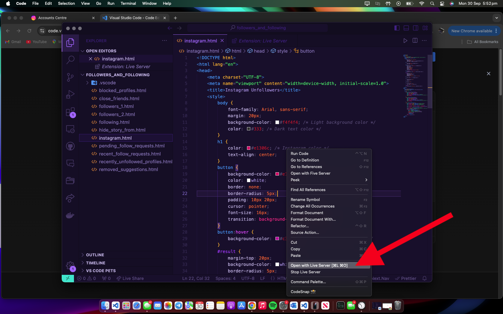
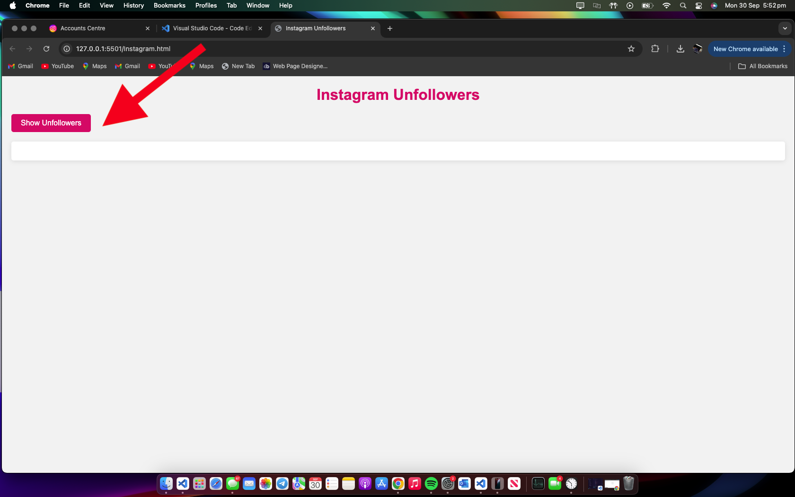

# InstaUnfollow-Tracker Guide

The **InstaUnfollow-Tracker** helps you track users who unfollowed you or those who don’t follow you back on Instagram. Follow this guide to set it up, complete with screenshots for each step.

---

## Step 1: Download Your Instagram Data

To begin, download your Instagram data, specifically followers and followings.

1. Go to Instagram > Settings > Privacy > Download Your Data.
2. Customize the download request to only include **followers** and **followings**.
3. Wait for Instagram to process your request and send you the download link via email.

---

## Step 2: Download VSCode

You will need [Visual Studio Code (VSCode)](https://code.visualstudio.com/) to run the InstaUnfollow-Tracker. Download and install VSCode.

---

## Step 3: Open Your Instagram Data

1. After receiving the email from Instagram, download the file containing your followers and followings data.
2. Unzip the file and navigate to the **connections** folder.

3. Inside, you’ll find **connections**. Click it, and you will see the **followers_and_following** file.

---

## Step 4: Drag Files into VSCode

1. Open VSCode and drag the **followers_and_following** file into the workspace.

2. Create a new file named `instagram.html`.

---

## Step 5: Add InstaUnfollow-Tracker Code

1. Download the InstaUnfollow-Tracker code from [this GitHub repository](#).
2. Copy the code into `instagram.html`, or if you downloaded the repo, just add the file in the **/connections/followers_and_following/instagram.html** folder.

---

## Step 6: Install Live Server Extension

1. In VSCode, search for the **Live Server** extension and install it.

2. Right-click the `instagram.html` file and select **Open with Live Server** to launch the code in your browser.

---

## Step 7: View Unfollowers

1. Once the page loads in your browser, you will see a button that says **Show Unfollowers**.
2. Click it to display the users you follow who don’t follow you back.

---

## Step 8: Unfollow Accounts

Now, you'll see a list of accounts that don’t follow you back. You can easily unfollow them, especially those too famous to follow back 😅.

Each username will be linked to their Instagram profile for quick access.

Enjoy keeping your followers list clean and in sync!

---

### Additional Notes

- Make sure to use this tool responsibly.
- Always download your Instagram data securely from the official platform.
